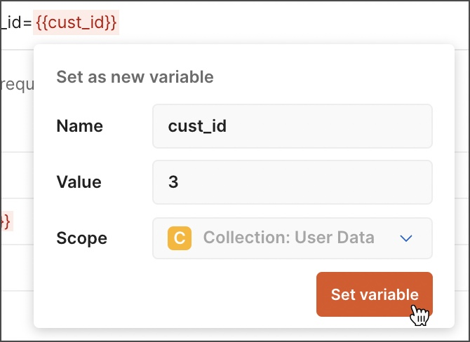
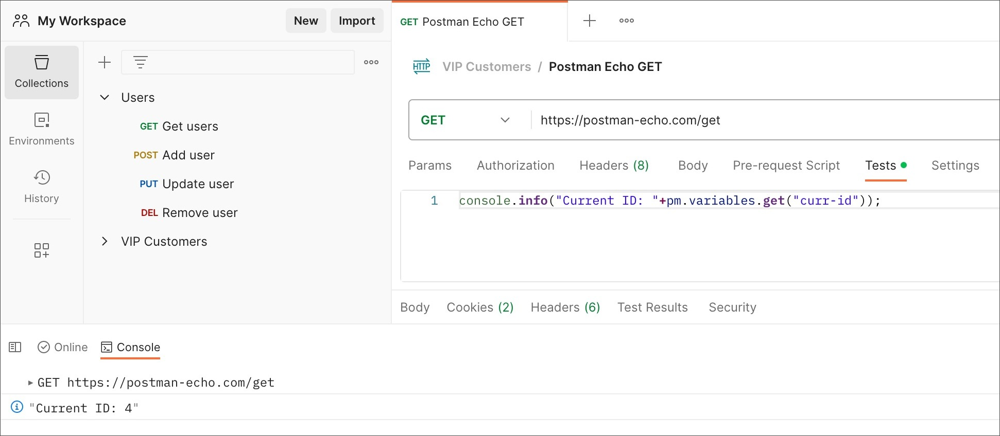
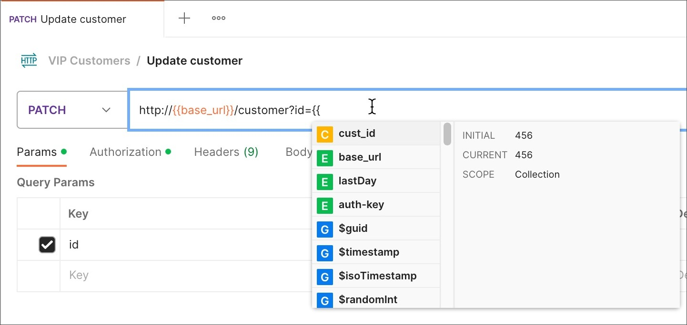

## Instead of creating the same requests with different data, you can use variables with parameters. These data can be from a data file or an environment variable.

Using variables

You can use double curly braces to reference variables throughout Postman. For example, to reference a variable named "username" in your request authorization settings, you would use the following syntax with double curly braces around the name:

`{{username}}`

For example, you could have a request URL referencing a variable as follows:

`https://postman-echo.com/get?customer_id={{cust_id}}`

Postman will send whatever value you currently have stored for the cust_id variable when the request runs. If `cust_id` is currently 3, the request will be sent to the following URL including the query parameter:

`https://postman-echo.com/get?customer_id=3`

If you are want to access a variable from within a request body, wrap its reference in double-quotes:

`{ "customer_id" : "{{cust_id}}" }`

1. Set your HTTP request to GET
2. Input this link: `https://jsonplaceholder.typicode.com/users`. Replace the first part of the link with a parameter such as `{{url}}`. Request url should now be `{{url}}/users`.
3. Click send.

## To use the parameter you need to set the environment

1. Click the eye icon
2. Click edit to set the variable to a global environment which can be used in all collections.

In variable,

1. Set the name to the url which is `https://jsonplaceholder.typicode.com`
2. click Save.

Go back to your Get request then click send. There should now be results for your request.

### Using dynamic variables
Postman provides dynamic variables you can use in your requests.

Examples of dynamic variables include:

`{{$guid}}` : A v4-style GUID

`{{$timestamp}}`: The current Unix timestamp in seconds

`{{$randomInt}}`: A random integer between 0 and 1000

### Logging variables
You can log variable values to the Postman Console while your requests run.

Use the following syntax in your script to log the value of a variable:

`console.log(pm.variables.get("variable_key"));`

To view the results, select Console icon Console in the footer. You can also access the console by selecting View > Show Postman Console.

As you add variables to your requests, Postman prompts you with any that are currently defined.

