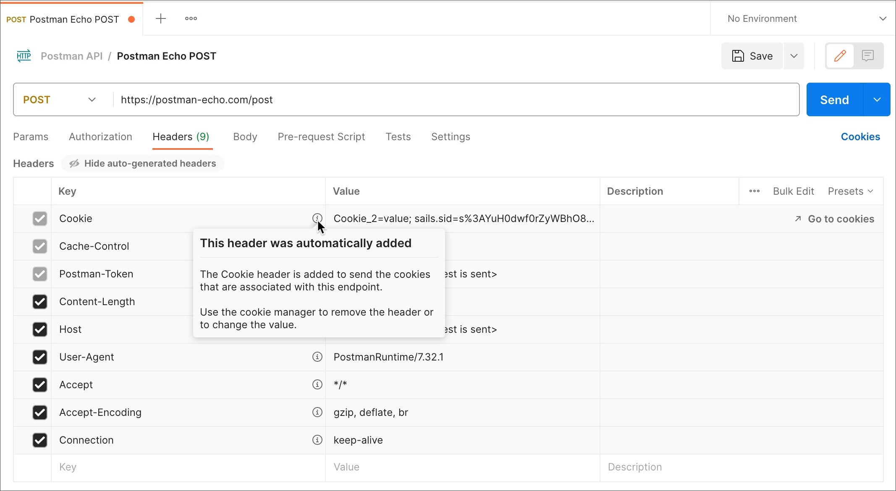

# Tabs

## Params

To send a query parameter, add it directly to the URL or open Params and enter the name and value. When you enter your query parameters in either the URL or the Params fields, these values will update everywhere they're used in Postman.

Path parameters form part of the request URL, and are referenced using placeholders preceded by ` : ` as in the following example: `/customer/:id`

To send a path parameter, enter the parameter name into the URL field, after a colon, for example `:id`. When you enter a path parameter, Postman will populate it in the Params tab, where you can also edit it.

You can add descriptions to your parameters and they'll appear for anyone sharing the request (for example in your workspace) or viewing your API documentation.

## Authenticating requests

Some APIs require auth details you can send in Postman. Authentication involves confirming the identity of the client sending a request, and authorization involves confirming that the client has permission to carry out the endpoint operation. Open the Authorization tab to configure your access details.

Configuring request headers
Some APIs require you to send particular headers along with requests, typically to provide more metadata about the operation you are performing. You can set these up in the Headers tab. Enter any key-value pairs you need and Postman will send them along with your request. As you enter text, Postman prompts you with common options you can use to autocomplete your setup, such as Content-Type.

Autogenerated headers
Postman will automatically add certain headers to your requests based on your request selections and settings. Select hidden at the top of the headers tab for information about what Postman will send with your request.

If you need to change a header, you can do so in the relevant part of Postman, for example the Authorization tab, the request Body, Cookies for the request domain, the Settings, and in some cases directly in the Headers tab itself.

To send body data with requests whenever you need to add or update structured data. For example, if you're sending a request to add a new customer to a database, you might include the customer details in JSON. Typically you will use body data with PUT, POST, and PATCH requests.

## Headers

Postman will automatically add certain headers to your requests based on your request selections and settings. Select hidden at the top of the headers tab for information about what Postman will send with your request.

If you need to change a header, you can do so in the relevant part of Postman, for example the Authorization tab, the request Body, Cookies for the request domain, the Settings, and in some cases directly in the Headers tab itself.

If a header has been added based on your auth setup, select the Authorization tab to change it.

To alter cookie headers, change the cookie setup for the domain you're sending the request to.

## Body
Response body
The Postman Body tab gives you several tools to help you understand the response quickly. You can view the body in one of four views: Pretty, Raw, Preview, and Visualize.

- Pretty -
The Pretty view formats JSON or XML responses so they're easier to view. Links inside Pretty view are highlighted, and selecting them can load a GET request in Postman with the link URL.

- Raw -
The Raw view is a large text area with the response body. It can indicate whether your response is minified.

- Preview -
The Preview view renders the response in a sandboxed iframe. Some web frameworks by default return HTML errors, and Preview can be especially helpful for debugging in those cases.

- Visualize -
The Visualize view renders the data in the API response according to visualization code that you add to the requests Tests. For details on how to add, use, and debug visualization code, see Visualizing responses.

The `Body` tab in Postman enables you to specify the data you need to send with a request. You can send various different types of body data to suit your API.

Choose the data type you need for your request body—form data, URL-encoded, raw, binary, or GraphQL.

### Form data
Website forms often send data to APIs as multipart/form-data. You can replicate this in Postman using the form-data Body tab. Form data enables you to send key-value pairs, and specify the content type.

You can attach files using form data. When you repeatedly make API calls that send the same files, Postman will persist your file paths for later use. This also helps you run collections that contain requests requiring file upload. Uploading multiple files each with their own content type isn't supported.

### URL-encoded
URL-encoded data uses the same encoding as URL parameters. If your API requires url-encoded data, select x-www-form-urlencoded in the Body tab of your request. Enter your key-value pairs to send with the request and Postman will encode them before sending.

### Raw data
Use raw body data to send anything you can enter as text. Use the raw tab, and the type dropdown list to indicate the format of your data (Text, JavaScript, JSON, HTML, or XML) and Postman will enable syntax-highlighting and appending the relevant headers to your request.

Body JSON
Set a content type header manually if you need to override the one Postman sends automatically.

Use variables in your body data and Postman will populate their current values when sending your request.

For JSON raw body data add comments, and they will be stripped out when the request is sent. Single-line comments delimited with // and multi-line comments delimited with /* */ will be removed in the request.

### Binary data
Use binary data to send information you can't enter manually in the Postman editor with your request body, such as image, audio, and video files (you can also send text files).

### GraphQL
Send GraphQL queries with your Postman requests by selecting the GraphQL tab in the request Body. Enter your code in the Query area and any variables in the GraphQL Variables section.

## Pre-request script

You can use pre-request scripts in Postman to execute JavaScript before a request runs. By including code in the Pre-request Script tab for a request, collection, or folder, you can carry out pre-processing such as setting variable values, parameters, headers, and body data. You can also use pre-request scripts for debugging code, for example by logging output to the console.

### An example usage of pre-request scripting could be as follows:

- You have a series of requests in a collection and are running them in a sequence, such as when using the collection runner.
- The second request is dependent on a value returned from the first request.
- The value needs to be processed before you pass it to the second request.
- The first request sets the data value from a response field to a variable in its Tests script.
- The second request retrieves the value and processes it in its Pre-request Script, then sets the processed value to a variable (which is referenced in the second request, for example in its parameters).

