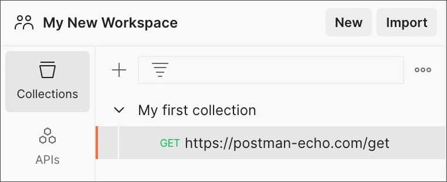
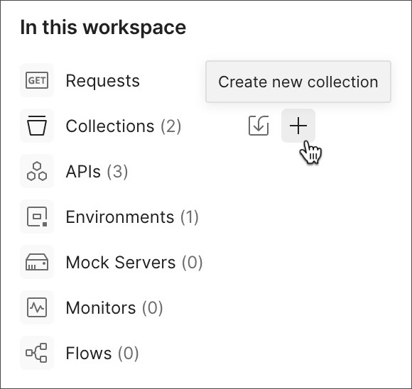
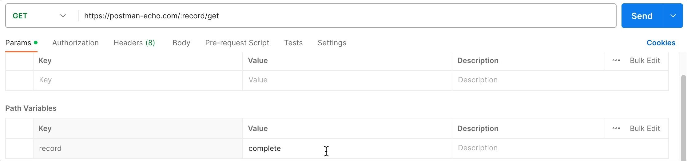
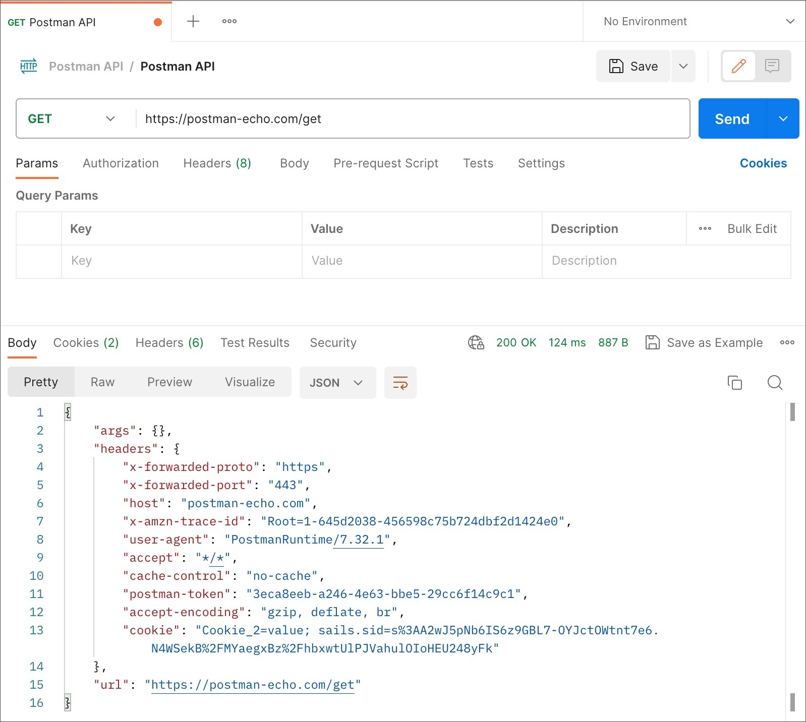
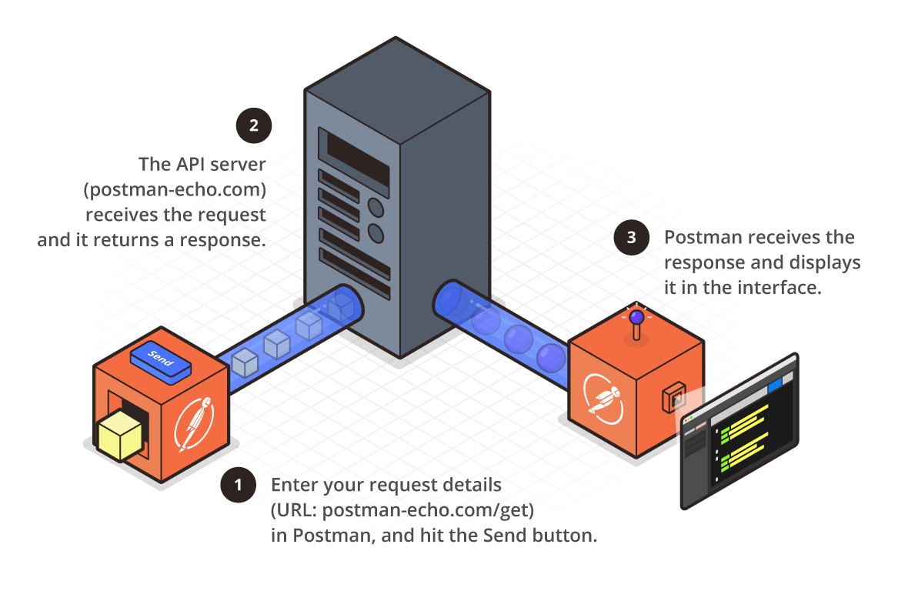

## Create your first collection
To create a new collection start by creating a new request first. Create a new request from the sidebar in Postman.  A new collection will appear. Edit its name, description, and many other settings.

### To create a collection, do the following:

1. Select `New > HTTP`.

2. Enter a request in the request builder and select `Save`.

3. Create a new collection by selecting `New Collection`. Enter a collection name, and then select `Create`.

4. Save request to collection.
Select `Save` to save the request in the new collection.

After save the request new collection and the request are listed under `Collections` in the sidebar.

Collection sidebar
Create a new collection from workspace's Overview tab. Under In this workspace, hover over Collections and select the + icon.

Create new request overview






### To import from a local GitHub repository:

1. Sign in to a Postman account to use this feature.

2. In Postman, select `Import` then select the GitHub button.

3. Confirm or sign in to your GitHub account and authorize postmanlabs to access your repositories if necessary.

Postman stores your authorized accounts so you can use them to connect to other repositories and services. Learn more about managing connected accounts for remote repositories.

3. In Postman, select your GitHub organization, repository, and branch, then select Continue.

4. Choose to import your API as a Postman Collection or as OpenAPI 3.0 with a Postman Collection.

If you're importing an API definition with multiple files, select the files you want to import into Postman, then select Import.

### Selecting request methods

By default Postman will select the GET method for new request. GET methods are typically for retrieving data from an API. Use a variety of other methods to send data to your APIs, including the following most common options:

- POST - add new data

- PUT - replace existing data

- PATCH - update some existing data fields

- DELETE - delete existing data

### For example with an API for To Do list application use a 

- GET method to retrieve the current list of tasks

- POST method to create a new task
 
- PUT or PATCH method to edit an existing task.


### Request URL has three parts 
- protocol(such as http:// or https://)

- host (location of the server) library-api.postmanlabs.com

- path (route on the server) /books

- query ?id=1&type=new 


```
https://library-api.postmanlabs.com/books?id=1&type=new 
```
### Path

Path parameters are request parameters attached to a URL that point to a specific REST API resource. 


### The path parameter is separated from the URL by a `/`, and from the query parameter(s) by a question mark (`?`). 
```
/books
```
The path parameter defines the resource location, while the query parameter defines sort, pagination, or filter operations.

 The user's input (the query) is passed as a variable in the query parameter, while each path parameter must be substituted with an actual value when the client makes an API call. The path parameter is contained within curly braces.

Path parameters are part of the endpoint and are required. For example, `/users/{id}`, `{id}` is the path parameter of the endpoint `/users`- it is pointing to a specific user's record. An endpoint can have multiple path parameters, like in the example `/organizations/{orgId}/members/{memberId}`. This would be pointing to a specific member's record within a specific organization, with both `{orgID}` and `{memberID}` requiring variables.

### Query

Query Parameter: These are appended to the end of the request URL, Query parameters are appended to the end of the request URL, following '?' and listed in key-value pairs, separated by '&' Syntax:
```
?id=1&type=new  
```

### Key-value
```
&type=new 
```
You can edit or add params in a Params tab 




### In the workspace GET

1. Set your HTTP request to GET.
2. In the request URL field, input link
3. Click Send
You will see 200 OK Message
There should be 10 user results in the body which indicates that your test has run successfully.

### In the new tab POST

1. Set your HTTP request to POST.
2. Input the same link in request url 
switch to the Body tab

In Body

1. Click raw
2. Select JSON

3. Copy and paste just one user result from the previous get request. 
4. Change id to 11 and name to any desired name. You can also change other details like the address.

Click Send.
Status: 201 Created should be displayed
Posted data are showing up in the body.


### Sending an API request

1. Select + in the workbench to open a new tab.
2. Enter `postman-echo.com/get` for the request URL.
3. Select Send.
Postman displays the response data sent from the server in the lower pane.

Sending a request





### Code 200 test 

1. In the request, go to the Tests tab.

2. In the snippet section to the right, select the snippet Status code: Code is 200. This will enter the following test code:
```
pm.test("Status code is 200", function () {
    pm.response.to.have.status(200);
});
```
3. Select Send.
4. Go to the Test Results section of the response to review the results of your test.


