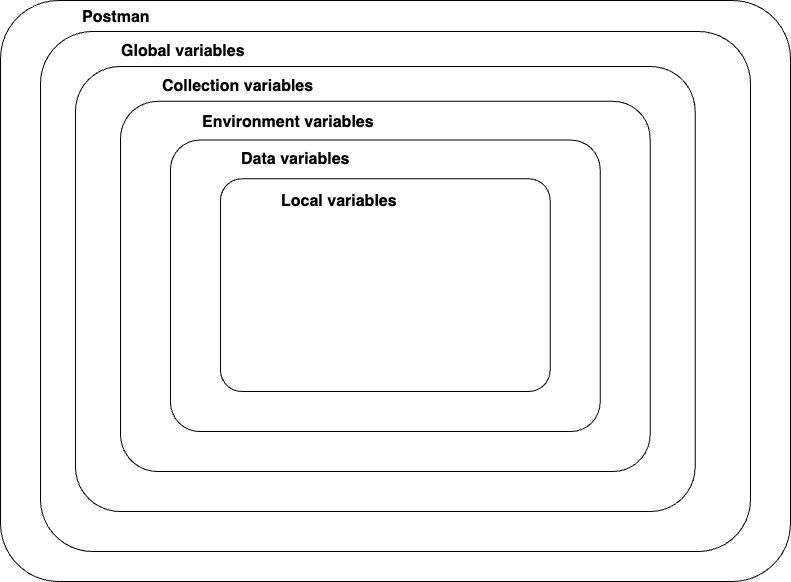
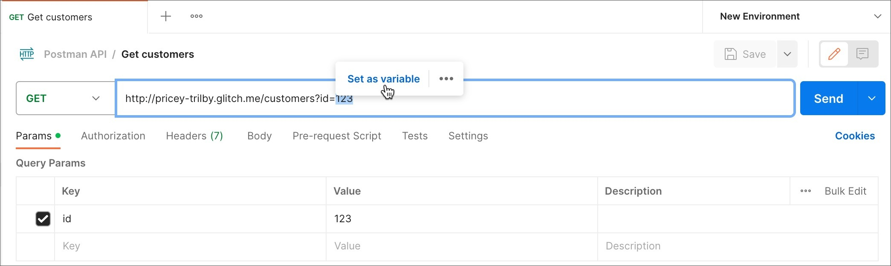
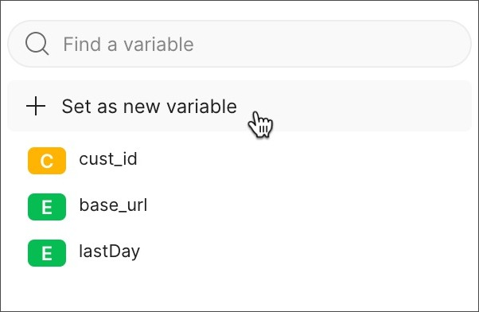
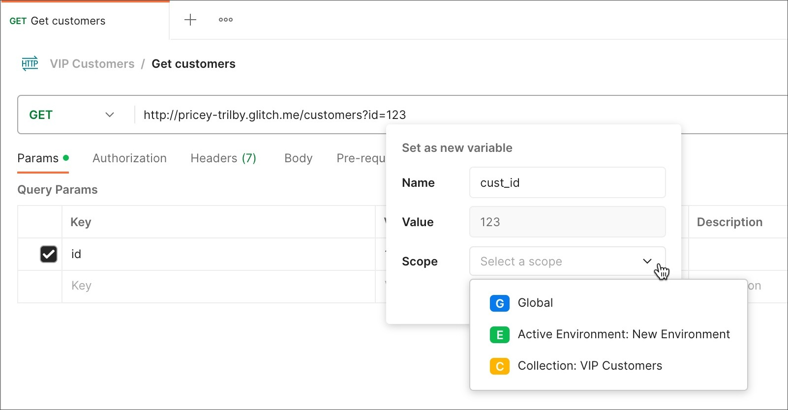
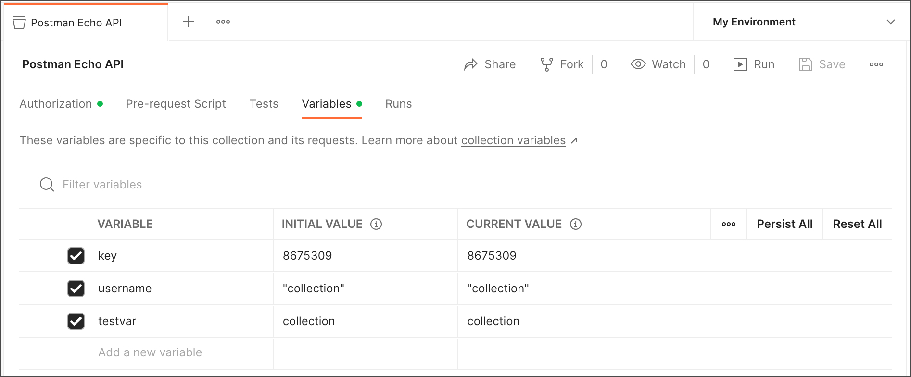

### Variables enable you to store and reuse values in Postman. By storing a value as a variable, you can reference it throughout your collections, environments, requests, and test scripts. Variables help you work efficiently, collaborate with teammates, and set up dynamic workflows.

In order from broadest to narrowest, these scopes are: global, collection, environment, data, and local.

### Global variables 
Enable you to access data between collections, requests, test scripts, and environments. Global variables are available throughout a workspace. Since global variables have the broadest scope available in Postman, they're well-suited for testing and prototyping. In later development phases, use more specific scopes.

### Collection variables
Available throughout the requests in a collection and are independent of environments. Collection variables don't change based on the selected environment. Collection variables are suitable if you're using a single environment, for example for auth or URL details.

### Environment variables 
Enable you to scope your work to different environments, for example local development versus testing or production. One environment can be active at a time. If you have a single environment, using collection variables can be more efficient, but environments enable you to specify role-based access levels.

### Data variables 
Come from external CSV and JSON files to define data sets you can use when running collections with Newman or the Collection Runner. Data variables have current values, which don't persist beyond request or collection runs.

### Local variables 
Temporary variables that are accessed in your request scripts. Local variable values are scoped to a single request or collection run, and are no longer available when the run is complete. Local variables are suitable if you need a value to override all other variable scopes but don't want the value to persist once execution has ended.

### Defining collection variables
You can add collection variables when you create the collection or at any time after that.

To create or edit a variable for an existing collection, do the following:

Select Collections in the sidebar.
Select a collection, and then select the Variables tab.

### Defining variables in scripts
You can set variables programmatically in your request scripts.

